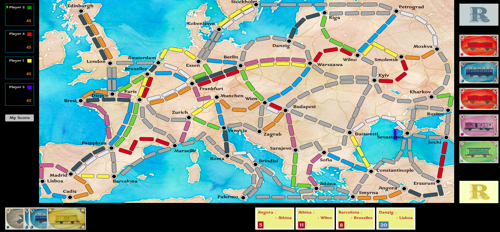

# Ticket to Ride Europe
This is a local version of Ticket to Ride Europe. Works with 2-5 players, typically on a local network with family or friends. It uses socket.io for communication and runs of a local node server. With ngrok or any tunnelling tool, one can expose the http port to external users

## Install 
1. `yarn install` to install node packages
2. `yarn build` to build the frontend using the excellent esbuild bundler
3. `yarn server` to run the server. It listens on port `4000`

Users then connect to http://ip-address:4000, where ip-address is the IP address of the machine running the server. e.g. http: /10.0.0.1:4000.

**Tip**: To change names of players or number of players, update the `client/data/userlist.json` and rebuild `yarn build` and restart server `yarn server`.

## Features
* Scalable to any screen size
* Turn based game with indicator of current player
* Scrollable ticket and train card areas for large number of cards or tickets
* Click on any ticket at any point in the game and it will highlight the source and destination places for easy identification of routes
* Main board can be zoomed/reset on pressing the `Z` key. Use arrow keys in zoom state to move board around 
* Ticket completion is shwon in green (all routes connecting the source and destination) are claimed by you. 
* Comprehensive error checking to ensure players do not accidently place trains on invalid route segments 
* Each player's current score on clicking the `My Score` button. Scores are calculated automatically and displayed at the end
* On game completion, final scores are calculated and score table is displayed
* Users can minimize board (at the risk of missing out the action) and resume
* Users can disconnect and connect back again and state is preserved as long as server is running
* Same rules and game play as official Ticket to Ride. See [Rules](./Rules.pdf). However, the first version has a simpler game play for gray routes. See Pending Features below.

## Tech stack
* Javascript and nodejs on backend
* esbuild bundler for frontend bundling
* Frontend vanilla javascript using SVG elements and CSS animations. An earlier verion used the popular Phaser game engine, but ended up rewriting to make it lighter and faster, with vanilla javascript and svg. No React, no Vue, no Angular. Just plain SVG elements and vanilla javascript and ES6 imports bunled using esbuild bundler. 

## Pending features
* Undo not supported yet
* Train stations, tunnels and ferries feature not implemented yet. Simpler game play treating all gray routes the same
* Save game state to disk across server restarts
* Change Player names and player count 
* Longest route (additional 10 points) 

## Game Play
One of the three game play options
1. Draw train cards - click on one of the five open train cards on rights or the blue closed train cards on top right corner. On every turn players can pick two (some rules apply for multi-color locomote cards). On picking two cards, the game automatically moves to the next player
2. Claim route - click on a specific train card you own (at bottom left portion of screen). It will pop out. The cursor changes to a `+` to click on a route segment. If you accidently clicked on a train card, click on it again to revert and choose another card or draw a train card. Once you select a route segment, it checks if you have sufficient matching train cards (including locomotive cards) to complete the route. Complete the route. Only on route completion, the game moves to next player
3. Draw tickets - After a player has claimed a few routes (atleast 10 train coins are used; each player gets a total of 45 coins as shown on the left for each player), the player can click the yellow ticket deck on the right below the open train deck. Three tickets are added to your ticket deck. Users can discard at most two of the tickets by clicking on the cancel button on the crd. Discarding can be done any time during any player's turn and is not counted as a valid turn. WARNING: If you three more tickets, the previous three cannot be discarded (as per the rules). 
*IMPORTANT*: As undo is not supported, clicking on it will add tickets to your ticket deck (on the bottom right), which when unclainmed at the end, will reduce your score. However clicking on it during the initial part of game is prevented, to prevent accidental clicks. 

Finally the left side is the player dashboard. It shows the order of player turns. Every new game, the players are sorted randomly and coin colors are randomly picked. At the start, each player gets 45 coins. The game gets to the final round when one of the players gets to two coins. 

## Notes
This is a fully functional version, as I continue to play this version with my family. Feel free to fork and use it. If you like this version, star it. The `server` and `client` code are pretty simple. Do take a look. If you find any issues, feel free to raise bug. 
